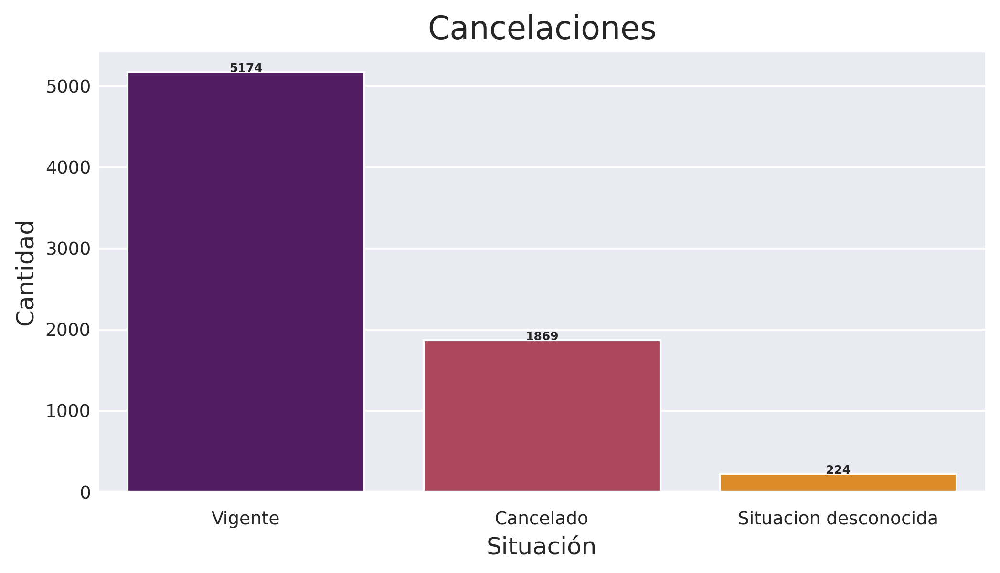
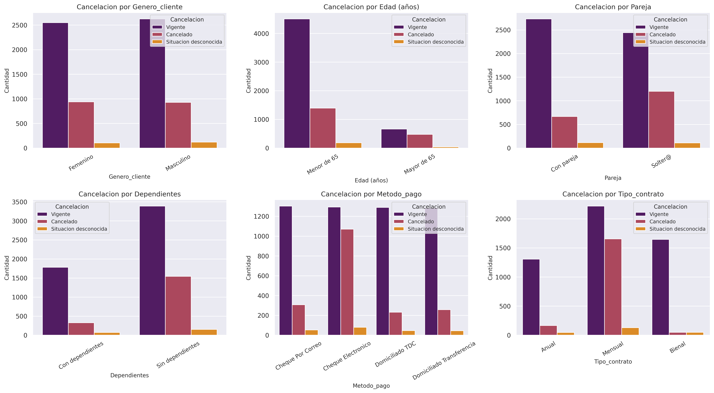
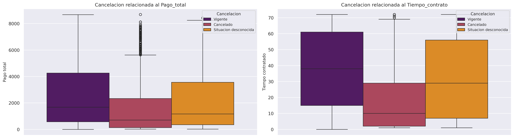

# TelecomX_ChallengeAlura
# Análisis de Churn de Clientes - TelecomX

## 📋 **INTRODUCCIÓN**

El presente análisis tiene como objetivo identificar los factores que influyen en la cancelación de servicios (churn) de los clientes de TelecomX. A través del análisis exploratorio de datos, buscamos comprender los patrones de comportamiento de los clientes que cancelan para desarrollar estrategias efectivas de retención.

---

## 🔧 **METODOLOGÍA**

### Herramientas Utilizadas
- **Python** con las librerías: pandas, numpy, matplotlib, seaborn
- **Fuente de datos:** API JSON desde repositorio GitHub
- **Ambiente:** Google Colab

### Proceso de Análisis
1. **Extracción:** Importación de datos desde API
2. **Transformación:** Limpieza y tratamiento de datos faltantes
3. **Carga:** Creación del DataFrame final para análisis
4. **Exploración:** Generación de visualizaciones y análisis estadísticos

---

## 📊 **ANÁLISIS EXPLORATORIO DE DATOS**

### Distribución General del Churn
- **Total de clientes:** 7,043
- **Clientes activos:** 5,174 (73.5%)
- **Clientes que cancelaron:** 1,869 (26.5%)
- **Situación desconocida:** 224 (3.2%)

**Insight clave:** Aproximadamente 1 de cada 4 clientes cancela el servicio, lo que representa una tasa de churn considerable que requiere atención inmediata.

### Análisis por Variables Demográficas

#### Género
- No existe diferencia significativa en las tasas de cancelación entre hombres y mujeres
- Ambos géneros mantienen patrones similares de retención

#### Edad
- **Clientes menores de 65 años:** Mayor propensión a cancelar
- **Clientes mayores de 65 años:** Menor tasa de cancelación
- **Interpretación:** Los adultos mayores tienden a ser más fieles a los servicios

#### Estado Civil y Dependientes
- **Clientes con pareja:** Menor tasa de cancelación
- **Clientes con dependientes:** Mayor retención del servicio
- **Clientes solteros sin dependientes:** Mayor riesgo de churn

### Análisis por Características del Servicio

#### Tipo de Contrato (Factor Más Crítico)
```
Contrato Mensual: ALTA tasa de cancelación
Contrato 12 meses: MEDIA tasa de cancelación  
Contrato 24 meses: BAJA tasa de cancelación
```

#### Método de Pago
```
Cheque Electrónico: ALTA cancelación
Cheque por Correo: MEDIA-ALTA cancelación
Domiciliado/Transferencia: BAJA cancelación
```

#### Tipo de Internet
- **Fibra Óptica:** Sorprendentemente presenta la mayor tasa de cancelación
- **DSL:** Menor tasa de cancelación
- **Sin internet:** Tasa moderada de cancelación

### Análisis Financiero

#### Pago Total vs Churn
- Los clientes que cancelan no necesariamente son los de menor gasto
- Existe variabilidad en los montos de pago entre clientes que permanecen y cancelan

#### Tiempo de Contrato
- **Clientes nuevos (0-12 meses):** Mayor riesgo de cancelación
- **Clientes establecidos (>24 meses):** Mayor fidelidad y retención

---

## 📈 **VISUALIZACIONES**

### Gráfico 1: Distribución General del Churn


*Descripción: Gráfico de barras que muestra la distribución general de clientes activos, cancelados y con situación desconocida.*

### Gráfico 2: Análisis por Categorías


*Descripción: Panel de 6 subgráficos que muestran las tasas de cancelación por género, edad, estado civil, dependientes, método de pago y tipo de contrato.*

### Gráfico 3: Análisis Datos Numéricos


*Descripción: Diagramas de caja (boxplots) que comparan la distribución de pagos totales y tiempo de contrato entre clientes activos y cancelados.*

---

## 💡 **INSIGHTS RELEVANTES**

### 1. **Factor Contractual Determinante**
Los contratos mensuales son el principal predictor de churn. La flexibilidad que ofrecen también facilita la cancelación.

### 2. **Paradoja de la Fibra Óptica**
A pesar de ser un servicio premium, los clientes de fibra óptica cancelan más. Esto sugiere posibles problemas de calidad, expectativas no cumplidas o falta de soporte adecuado.

### 3. **Importancia de la Automatización**
Los métodos de pago automáticos están fuertemente correlacionados con mayor retención, sugiriendo que la comodidad influye en la permanencia.

### 4. **Perfil Familiar como Ancla**
Los clientes con responsabilidades familiares (pareja/dependientes) ven el servicio como más esencial y cancelan menos.

### 5. **Período Crítico de Retención**
Los primeros 12 meses son cruciales. Los clientes que superan este período tienden a mantenerse a largo plazo.

### 6. **Estabilidad en Adultos Mayores**
Los clientes >65 años representan un segmento de alta fidelidad, posiblemente por resistencia al cambio y valoración de la estabilidad.

---

## 🎯 **ESTRATEGIAS PARA REDUCIR EL CHURN**

### **Estrategia 1: Promoción de Contratos de Fidelización**
**Objetivo:** Migrar clientes de planes mensuales a anuales

**Acciones:**
- Ofrecer descuentos del 10-15% por contratos anuales
- Incluir beneficios adicionales (instalación gratuita, soporte prioritario)
- Campañas dirigidas a clientes con contratos mensuales y más de 6 meses de antigüedad

### **Estrategia 2: Mejora del Servicio de Fibra Óptica**
**Objetivo:** Reducir la alta cancelación en este segmento premium

**Acciones:**
- Implementar programa de seguimiento post-instalación
- Mejorar el soporte técnico especializado para fibra
- Realizar encuestas de satisfacción específicas para identificar puntos de dolor
- Considerar ajustes en expectativas durante la venta

### **Estrategia 3: Incentivos para Pagos Automáticos**
**Objetivo:** Migrar clientes a métodos de pago automatizados

**Acciones:**
- Descuentos del 3-5% por domiciliar pagos
- Simplificar el proceso de cambio de método de pago
- Campañas educativas sobre beneficios de automatización
- Recordatorios proactivos sobre vencimientos para pagos manuales

### **Estrategia 4: Programa de Retención Temprana**
**Objetivo:** Reducir churn en los primeros 12 meses

**Acciones:**
- Plan de bienvenida con seguimiento en meses 3, 6 y 9
- Ofertas especiales para nuevos clientes en período de prueba
- Soporte proactivo para resolver problemas iniciales
- Programa de referidos para nuevos clientes

### **Estrategia 5: Segmentación Familiar**
**Objetivo:** Aprovechar la estabilidad de clientes con familia

**Acciones:**
- Desarrollar planes familiares atractivos
- Ofertas especiales para parejas o familias
- Servicios adicionales orientados al hogar
- Programas de fidelidad que incluyan beneficios familiares

### **Estrategia 6: Retención de Adultos Mayores**
**Objetivo:** Mantener y expandir este segmento fiel

**Acciones:**
- Soporte especializado y personalizado
- Canales de atención preferencial
- Planes adaptados a necesidades específicas
- Programas de descuentos para adultos mayores

---

## 🏁 **CONCLUSIONES**

El análisis revela que el churn en TelecomX está principalmente impulsado por factores relacionados with la flexibilidad contractual, métodos de pago y calidad percibida del servicio. 

**Los hallazgos más importantes son:**
- Los contratos mensuales representan el mayor riesgo de cancelación
- La fibra óptica requiere atención urgente por su alta tasa de churn
- Los pagos automáticos son un fuerte predictor de retención
- El perfil demográfico familiar es más estable

**La implementación de las estrategias propuestas debería:**
- Priorizar la migración a contratos anuales
- Resolver los problemas de satisfacción en fibra óptica
- Promover agresivamente los pagos automáticos
- Implementar un programa integral de retención temprana

Con estas acciones, TelecomX puede reducir significativamente su tasa de churn y mejorar la retención de clientes de manera sostenible.
